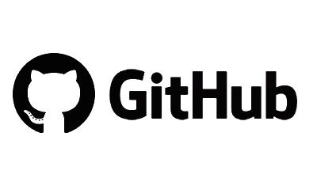

```{r setup, include=FALSE}
knitr::opts_chunk$set(echo = FALSE)
```

## El código cambia y se comparte

Al escribir código existen dos problemas a resolver:

- Organizar las versiones derivadas del desarrollo
- Empatar la colaboración entre los diferentes programadores

> ¿Como compartimos código y lo mantenemos respaldado?

## Git

Git es un programa que corre en tú computadora cuyo principal objetivo es mantener el control de versiones.
Ademas permite la participación coordinada de diferentes colaboradores.

{#show-logo}

## ¿Como funciona?

**Git** permite mantener un registro de cambios en los archivos, una especie fotografía del directorio.
Este directorio recibe el nombre de **repositorio**.

Cada fotografía es un **commit**, estos commit suelen incluir un mensaje con información relevante de los 
cambios hechos en esta instantanea.

En conjunto estos registros contienen la **historía completa** de los cambios que se han dado en el repositorio.


## Github

Github es un servició en linea que  aloja proyectos utilizando el control de versiones **Git**. Estos proyectos
pueden estar disponibles en forma **publica** o **privada**. 

El servicio permite dar acceso a diferentes colaboradores manteniendo un control derivado de la autenticación con el 
servicio, los permisos otorgados e incluso el esquema que se utilice.

{#show-logo}

## Configuración | Credenciales

Una vez instalado debemos configurar el usuario y el correo electronico que usaremos:

```{bash eva=F, echo=T}
git config --global user.name "miusuario"
git config --global user.email "miusuario@micorreo.com"
```

- **config** comando para configurar git
- **global** define al usuario para cualquier repositorio en nuestro equipo, sin el solo aplica para el repositorio actual.
- **user.name** y **user.email** son las credenciales que tenemos para el repositorio. 

## Comandos Diarios | El mantra de git

**Git** añade pasos extras al proceso de guardar nuestros scripts. Pasos que permite **agregar** nuestros archivos a
git, crear un mensaje una especie de **registro** de cambio. Por último se **suben** los cambios al repositorio.

```{bash echo = TRUE, eval=FALSE}
git add Archivo_Modificado
git commit -m "Mensaje corto descriptivo"
git push origin master
```

## Primer paso | Agregar archivos

```{bash echo = TRUE, eval=FALSE}
### <b>
git add Archivo_Modificado
### </b>
git commit -m "Mensaje corto descriptivo"
git push origin master
```

## Segundo paso | Se agrega registro del cambio

```{bash echo = TRUE, eval=FALSE}
git add Archivo_Modificado
### <b>
git commit -m "Mensaje corto descriptivo"
### </b>
git push origin master
```

## Tercer paso | Se manda información al repositorio

```{bash echo = TRUE, eval=FALSE}
git add Archivo_Modificado
git commit -m "Mensaje corto descriptivo"
### <b>
git push origin master
### </b>
```